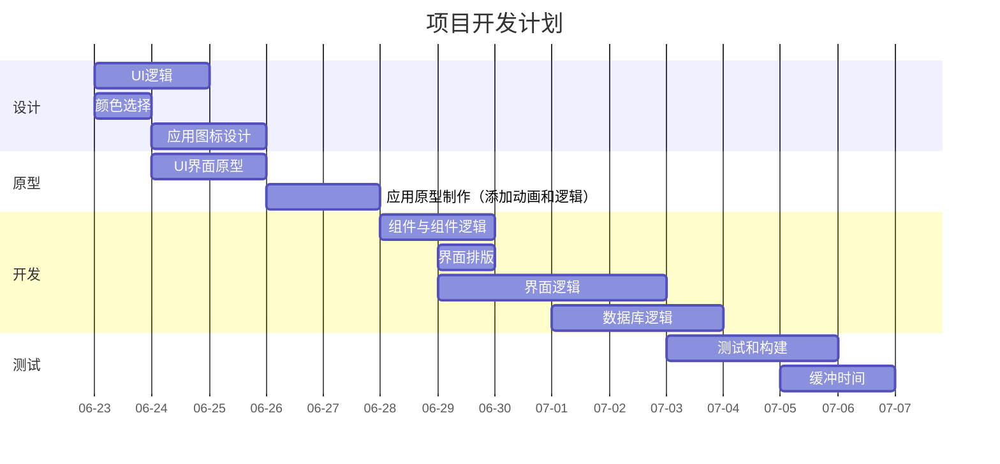

```mermaid
gantt
    axisFormat  %m-%d
    title 项目开发计划
    section 设计
    UI逻辑: a, 2025-06-23, 2d
    颜色选择: b, 2025-06-23, 1d
    应用图标设计: after b, 2d
    section 原型
    UI界面原型: after b, 2d
    应用原型制作（添加动画和逻辑）: c, 2025-06-26, 2d
    section 开发
    组件与组件逻辑: after c, 2d
    界面排版: d, 2025-06-29, 1d
    界面逻辑: e, 2025-06-29, 4d
    数据库逻辑: f, 2025-07-01, 3d
    section 测试
    测试和构建: g, 2025-07-03, 3d
    缓冲时间: h, 2025-07-05, 2d
```